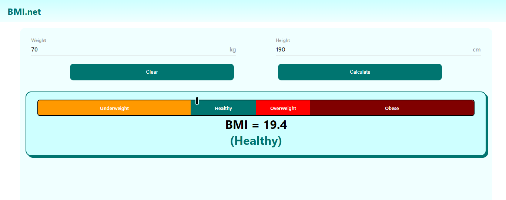

# BMI.net

This is a simple website built using React that allows users to calculate their Body Mass Index (BMI). 

BMI is a measure of body fat based on height and weight, and it is commonly used to assess whether an individual is underweight, normal weight, overweight, or obese.

### Features

- Calculate BMI based on user input for height and weight.
- Display the calculated BMI along with a corresponding BMI category.

### Technologies Used

- React
- TypeScript
- CSS3

### Usage

#### To run this project locally, follow these steps:

1. Clone this repository
2. run `npm install`
3. run `npm start`
4. Open [http://localhost:3000](http://localhost:3000) to view it in the browser.

## Disclaimer

### This project is for educational purposes only & was made based on the requirements of the first assignment of the CSIS279 course.
